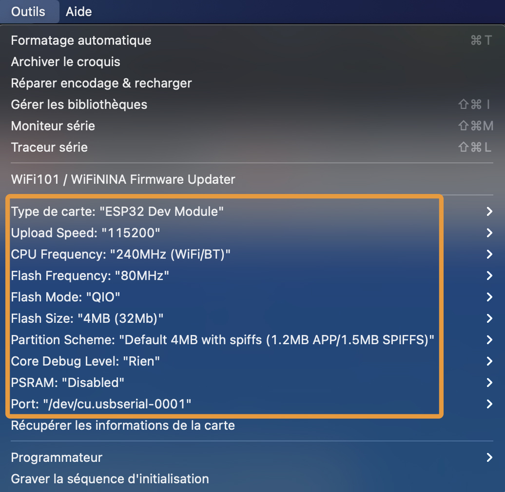
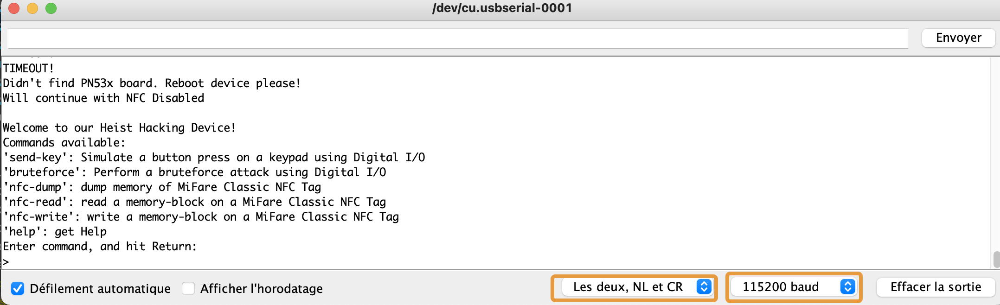

# Arduino 101

## How to flash your Device

### Select the right device

You should select ESP32-Dev Module, with the right Serial port, and an upload speed of 115200 bps (or higher).

### Put your device into bootloader mode

By default, every Arduino Device contains a program. In order to flash it, you need to reset it into Bootloader mode **each time** you want to flash.

On most systems, the flashing is made automatically by Arduino. Sometimes though, it might not work.
In that case, just do the following on your device:

To do this, follow the following steps on your ESP-32:
* Push and hold the EN button (it means "ENABLE").
* Push and hold the BOOT button (it means "BOOTLOADER").
* Release the EN button. When you release the EN button, the device will reboot.
* After 1 second, release the BOOTLOADER button

## How to interact
Your Hacker device uses the Serial Monitor to display and execute commands.

To access the monitor and start interacting with your hacker device, open **Tools -> Serial Monitor**.
In french **Outils -> Moniteur Série**.

In the Serial Monitor, select the right baud rate (115200 bps), and select the line ending behaviour to **Both NL and CR** (equivalent of sending **\n\r** after each time you enter a command and press enter).

Once your device is connected, you should be able to see your CLI appear and interact with commands.
