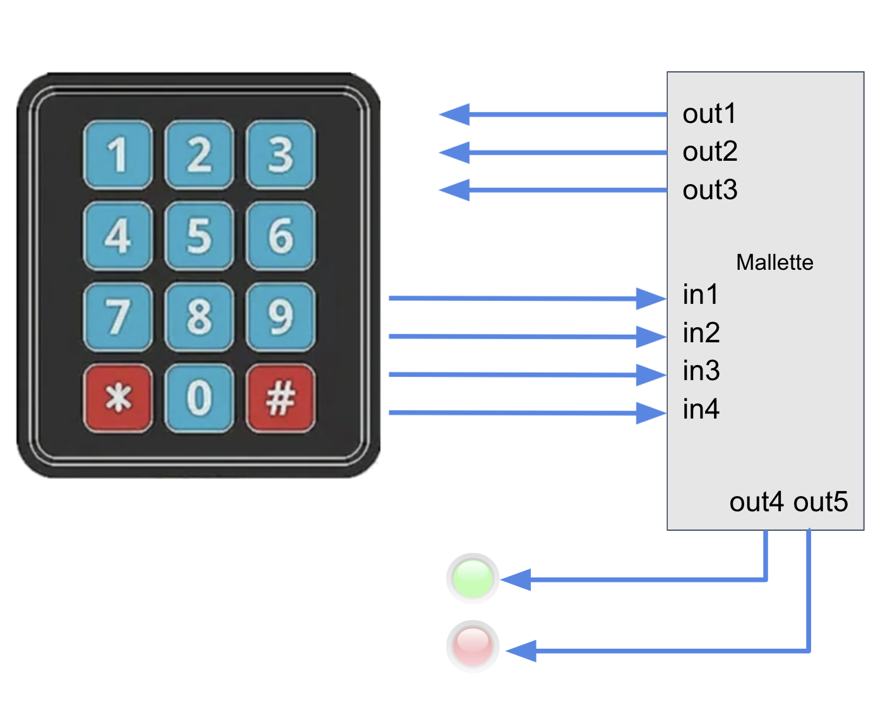
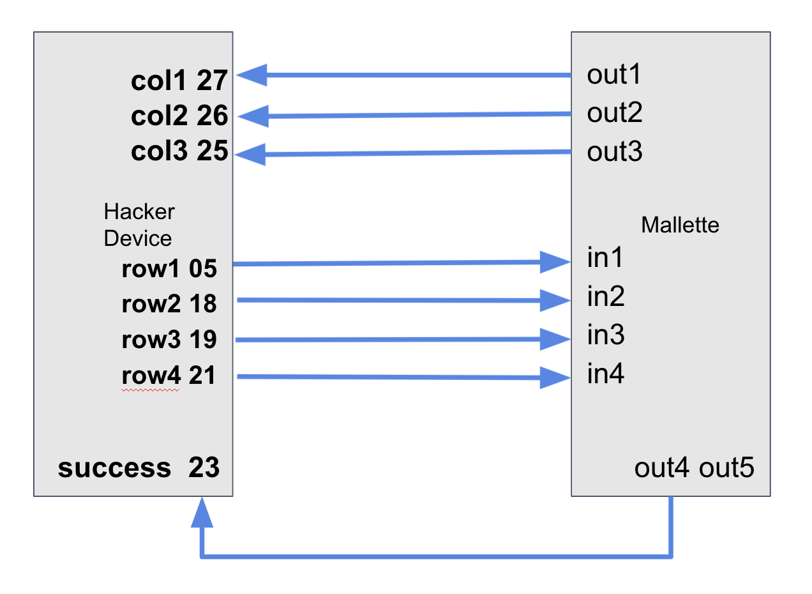

# Edward's hacking Device: Getting Started

## About the device
This device will allow you to:
 - perform hardware bruteforce attacks on GPIO pins
 - read / write Mifare NFC cards

## 1. Bruteforce wiring
To perform bruteforce attacks on any GPIO keypad, you need to spoof the keypad.

Keypads are usually wired this way:  

 - Columns are set to high or low by the keypad controller
 - Rows are read by the keypad controller

Most of the time, keypad controllers also render a direct feedback to tell if key-combination was right or wrong.
This can either be software or hardware (i.e. a green or red LED).

Therefore, a target wiring may look like this (the GPIO pins match an ESP32 controller):

## 2. NFC-wiring
In order to use NFC devices, the hacking microcontroller has to be wired to the NFC board using a SPI connection.

SPI Connections should be wired to all slaves with 3 main bus:
 - **CLOCK**: to sync all slave devices. Can also be named SCK, CLK, SCL or SCLK (Serial Clock)
 - **MISO** (Master Input Slave Output)
 - **MOSI** (Master Output Slave Input)

Additionnally, each slave should be connected to a specific GPIO output on the microcontroller, for **SS** (Slave Select), also called **CS** (Cable Select).
All slave selectors should be indexed, using 0-based indices. For instance, your first slave cable select output should be named **CS0**.

Most of the time, on ESP32 microcontrollers, SPI connections are using pins 18, 19 and 23, with the first CS0 on pin 5.

Beware, your NFC board needs to be wired to "speak" the SPI Standard.

**Warning**: In order for your NFC-Board to work, it also has to be powered on. You can use the VIN of your microcontroller (5V) and your GNC to make sure it has the necessary power to work properly. 
