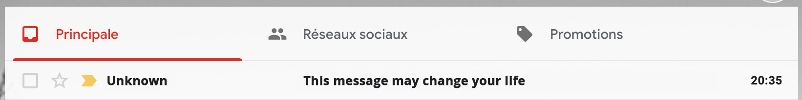
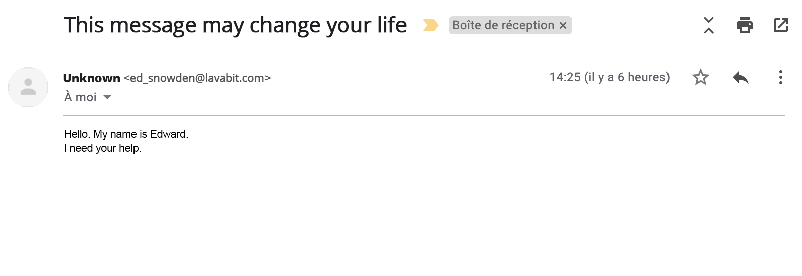

# The-Heist - Game Guide

Today is a beautiful sunday at **NSA**.  
You are not one of the spies or any of those exciting job titles.  
Nope, your job consists mostly of developing webapps for small internal services in that big not-so-well-organized organization.
And today is release day, so you and your team had to leave someone behind, just to monitor that everything goes well.  
Guess who drew the shortest straw, huh?  

Anyway. Here goes your sunday... And when you thought nothing really exciting would happen to you, you find this in your mailbox:

You open it up and discover its content...

INCREDIBLE. The REAL Edward Snowden needs your help. Quick, you find a way to establish secure communications with him (hey, come on, it's a game alright?!).

Basically, he is seeking very important documents which are stored in a safe in the archive department. Going to the archive department is no trouble at all since you have a high-enough security clearance to access it. The only problem is that the safe needs SC level 6 to open... And you're only SC 4.

Fortunately, Edward has managed to get his hands on the briefcase of one of the SC 6 employees. You know that tomorrow, the employee will probably report its loss so your window of action is well... Now.

You only have a couple hours to find a way to open the briefcase and go open the safe.

## Before your Start

### Install Arduino
Make sure Arduino is installed on your computer [https://www.arduino.cc/en/main/software](https://www.arduino.cc/en/main/software)

### Install ESP32 Espressif using Arduino IDE Boards Manager

Stable release link: `https://raw.githubusercontent.com/espressif/arduino-esp32/gh-pages/package_esp32_index.json`  
Development release link: `https://raw.githubusercontent.com/espressif/arduino-esp32/gh-pages/package_esp32_dev_index.json`  

- Start Arduino and open Preferences window.
- Enter one of the release links above into *Additional Board Manager URLs* field. You can add multiple URLs, separating them with commas.
- Open Boards Manager from Tools > Board menu and install *esp32* platform (and don't forget to select your ESP32 board from Tools > Board menu after installation).
- Restart Arduino

### Clone this repository
`git clone https://github.com/resourcepool/the-heist`

### Add Arduino libraries

Copy the content of the **libraries** directory to your Documents/Arduino/libraries folder

Restart Arduino IDE.

## Game start

Whenever the game master gives his go, you can go ahead and browse to the right game section. Start with **chapter one**.

**Open the briefcase**

[Chapter one steps are available here](ch1-open-briefcase.md)

**Surprise surprise**

[Chapter two steps are available here](ch2-surprise-surprise.md)
